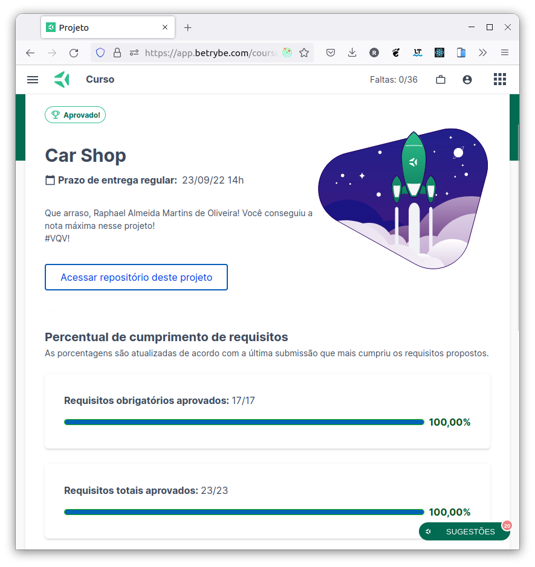

# :red_car: MongoDB Car Shop :motorcycle:


## :page_with_curl: About/Sobre

<details>
  <summary markdown="span"><strong>:us: English</strong></summary><br />

MongoDB, Node.js, Express.js, TypeScript, OOP (Object-Oriented Programming) and SOLID project developed by [Raphael Martins](https://www.linkedin.com/in/raphaelameidamartins/) at the end of Unit 30 ([Back-end Development Module](https://github.com/raphaelalmeidamartins/trybe_exercicios/tree/main/3_Desenvolvimento-Back-end)) of Trybe's Web Development course. I was approved with 100% of the mandatory and optional requirements met.

We had to develop a RESTful API for a Car shop using OOP (Object-Oriented Programming) and SOLID principles with a MongoDB database. We also had to implement unit tests.
<br />
</details>

<details>
  <summary markdown="span"><strong>:brazil: Português</strong></summary><br />

Projeto de MongoDB, Node.js, Express.js, TypeScript, POO (Programação Orientada a Objetos) e SOLID desenvolvido por [Raphael Martins](https://www.linkedin.com/in/raphaelameidamartins/) ao final do Bloco 30 ([Módulo Desenvolvimento Back-end](https://github.com/raphaelalmeidamartins/trybe_exercicios/tree/main/3_Desenvolvimento-Back-end)) do curso de Desenvolvimento Web da Trybe. Fui aprovado com 100% dos requisitos obrigatórios e opcionais atingidos.

Tivemos que desenvolver uma API RESTful para uma loja de veículos utilizando POO (Programação Orientada a Objetos) e princípios de SOLID com um banco de dados MongoDB. Também tivemos que implementar testes unitários.
<br />
</details>

## :man_technologist: Developed Skills/Habilidades Desenvolvidas

<details>
  <summary markdown="span"><strong>:us: English</strong></summary><br />

* Create classes
* Define types and interfaces
* Use OOP concepts such as Abstraction, Encapsulation, Inheritance, Composition and Polymorfism
* Use SOLID principles, such as Single Responsability, Open/Closed, Dependency Inversion, Substitution (Liskov) and Interface Segregation
* Develop a Express.js application with TypeScript
* Use a MongoDB database
* Use Mongoose.js with TypeScript
* Create a RESTful API
* Implement unit tests
<br />
</details>

<details>
  <summary markdown="span"><strong>:brazil: Português</strong></summary><br />

* Criar classes
* Definir types e interfaces
* Utilizar conceitos de POO como: Abstração, Encapsulamento, Herança, Composição e Polimorfismo
* Utilizar princípios de SOLID como: Responsabilidade Única, Aberto/Fechado, Inversão de dependência, Substituição de Liskov e Segragação de Interfaces
* Desenvolver uma aplicação Express.js com TypeScript
* Utilizar um banco de dados MongoDB
* Utilizar o Mongoose.js com TypeScript
* Criar uma API RESTful
* Implementar testes unitários
<br />
</details>

## :hammer_and_wrench: Tools/Ferramentas

* TypeScript
* Node.js
* Express.js
* Mongoose.js
* MongoDB
* Mocha.js
* Chai.js
* Sinon.js
* Docker
* OOP (Object-Oriented Programming)
* SOLID

## :hammer_and_wrench: Installation and execution/Instalação e execução

<details>
  <summary markdown="span"><strong>:us: English</strong></summary><br />

To run this application you need to have **Git**, **Docker** and **Docker Compose** installed on your machine. Docker Compose needs to be at **1.29** version or superior.

### 1 - Clone the repository and enter the application folder
```sh
git clone git@github.com:raphaelalmeidamartins/mongodb-car-shop.git && cd mongodb-car-shop
```

### 2 - Run the containers by running the command below in the application folder
```sh
docker-compose up -d --buid
```

### , - Access the documentation and make requests to the server running on the port 3001

Access the route http://localhost:3001/docs/en to see the English documentation and try the API. If you prefer, you can use a HTTP requests client of your choice (Insomnia, Thunder Client, etc) to make requests.

<br />
</details>

<details>
  <summary markdown="span"><strong>:brazil: Português</strong></summary><br />

Para rodar está aplicação é necessário ter **Git**, **Docker** e o **Docker Compose** instalados no seu computador. O Docker Compose precisa estar na versão **1.29** ou superior.

### 1 - Clone o repositório e entre na pasta da aplicação
```sh
git clone git@github.com:raphaelalmeidamartins/mongodb-car-shop.git && cd mongodb-car-shop
```

### 2 - Rode os containers executando o comando abaixo na pasta raiz da aplicação
```sh
docker-compose up -d --build
```

### 6 - Acesse a documentação e faça requisições para o servidor aberto na porta 3001

Acesse a rota http://localhost:3001/docs/br para acessar a documentação em português e testar a API. Se preferir, utilize um cliente de requisições HTTP de sua preferência (Insomnia, Thunder Client, etc) para fazer as requisições.
<br />
</details>

## :books: Documentation/Documentação

<details>
  <summary markdown="span"><strong>:us: English</strong></summary><br />

With the application running, enter the http://localhost:3001/docs/en route on your browser to see the English documentation.
<br />
</details>

<details>
  <summary markdown="span"><strong>:brazil: Português</strong></summary><br />

Com a aplicação em execução, acesse a rota http://localhost:3001/docs/br no navegador para ver a documentação em português.
<br />
</details>

## :test_tube: Tests coverage/Cobertura de testes

<details>
  <summary markdown="span"><strong>:us: English</strong></summary><br />

Run the following command in the root directory of the project to check the tests coverage:

```sh
npm run test:coverage
```


<br />
</details>

<details>
  <summary markdown="span"><strong>:brazil: Português</strong></summary><br />

Execute o comando abaixo no diretório raiz do projeto para verificar a cobertura de testes.

```sh
npm run test:coverage
```


<br />
</details>

## :trophy: Grade/Nota


